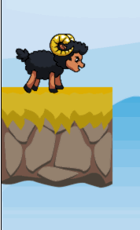

# Aufgabe 4: Schaf animieren

Benutze alle Animationsphasen aus `assets/Black_Sheep_Idle.png` um die Idle-Animation des Schafs zu rendern.

Bildgröße der einzelnen Animationsphasen im Tileset: **325\*464**

**Hinweis 1:** Zum Zeichnen wird `requestAnimationFrame((timestamp) => {...})` benötigt. Der Callback hat einen Parameter `timestamp` der die Zeit seit Start des Loops.

**Hinweis 2:** Ein guter Wert ist ein Animationphasenwechsel alle ~200ms

**Hinweis 3:** Implementiert zumindest folgende Methoden im Player:

- update(timestamp)
- shouldUpdate(timestamp)

## Ergebnis

